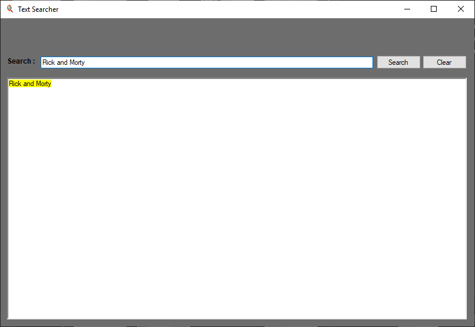
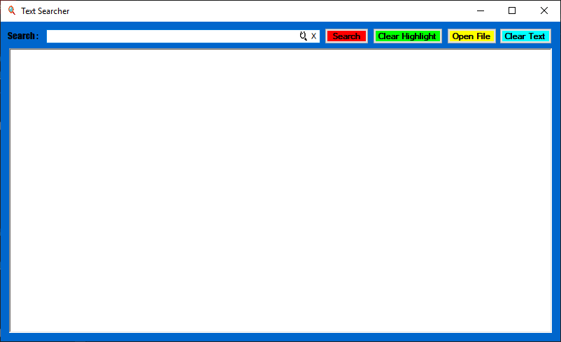
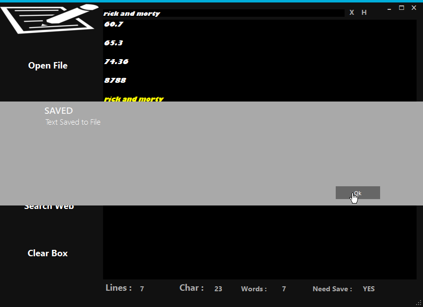
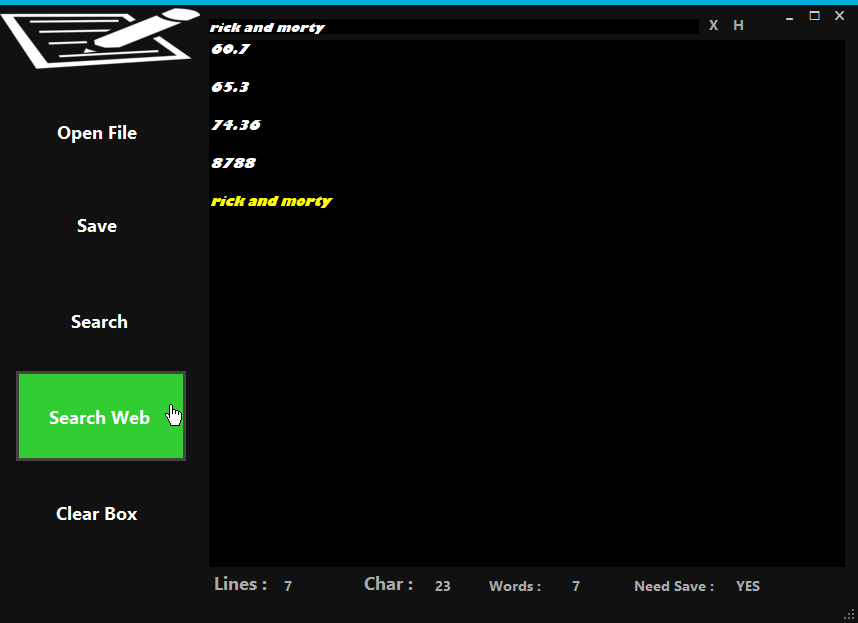
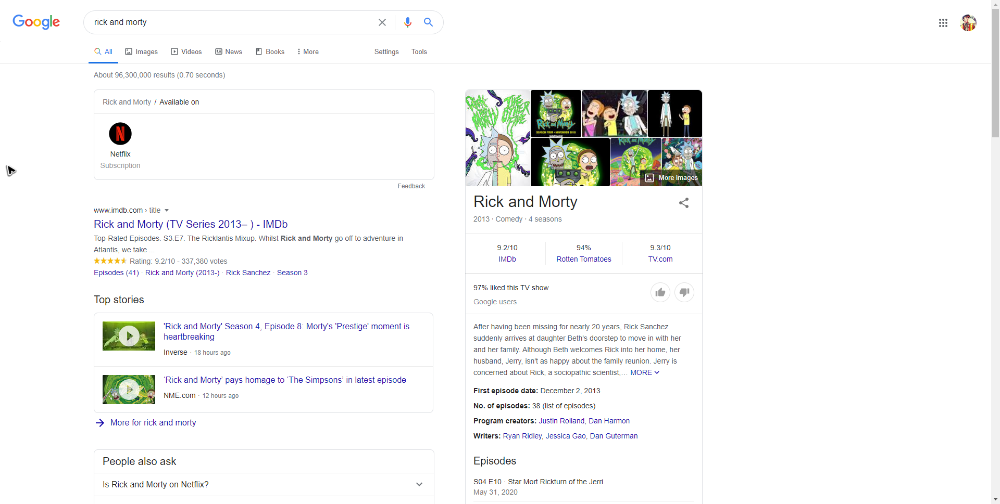
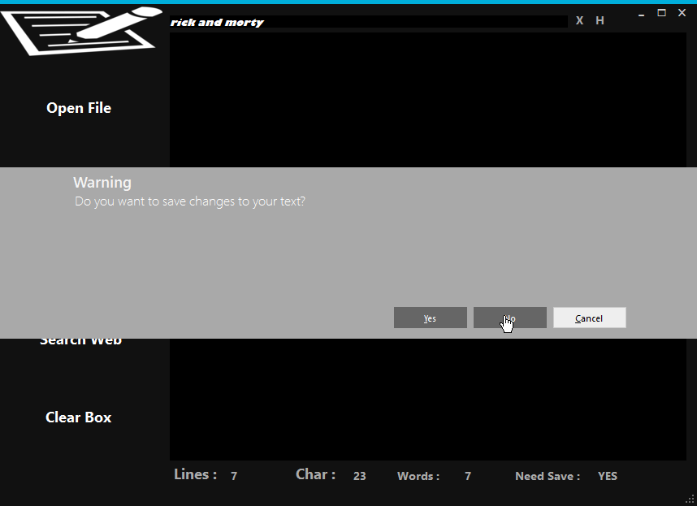

# Noto - Pado

Noto-Pado is simple NotePad editor for text files with simple search & highlight, searching through Web for searched text, and simple basic funtions of creating/saving/overwriting files.

  - Read - Edit -Save 
  - Dark UI for eye friendly experience

# New Features!
  - V-1.0 - added search amd highlight text , clear highlight 
  - V-1.5 - added open file, Search Web & Enter Key Press for Search, Slight Face Lift of design
  - V-2.0 - Complete redsign of the App using Metro Modern UI
  - V-2.1 - added Save feature, "Crtl + o & Ctrl + S" shotrcuts for opening file and Saving respictively 
  - V-2.2 - check if changes to be saved before exiting, or saving text before opening new file, saving text to file if no file exists

# Version & Features Highlights
 * V-1.0 - Basic Search & highlight
 
 
 
 * V-1.5 - Open File and Clear Text with slight UI design shift
 
 
 
 * V-2.2 - Design Reboot, with Saving and user prompt before exiting
    - Search & Highlight
    
    
    - Save confirmation
    
    
    - Web Search & Result
    
    
  
    - Save Prompt before exiting
    

### Tech

Noto-Pado Uses simple basic tools:

* [MetroModernUI 1.4.0] - Metro Modern UI or MetroFramework brings Windows 8 UI to .NET Windows Forms applications.
* [.NET 4.6.1] - .Net Frame Work.
* [Win Forms] - Windows Forms for creating Windows Application.

### Installation

Not Much Needed Just run the release and your Good to Go!

### Development

Want to contribute? Great!

Just make a Pull Request and make your magic!

### Todos

 - Add drag and drop files
 - switch for Dark & Light Modes
 - App window scaling freely
 - Fix arising bugs

License
----

MIT

**Free Software, Hell Yeah!**
